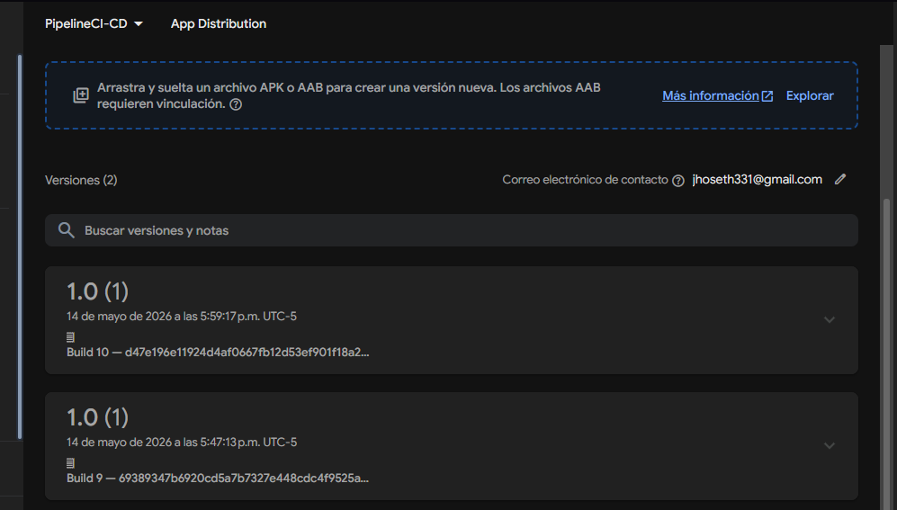
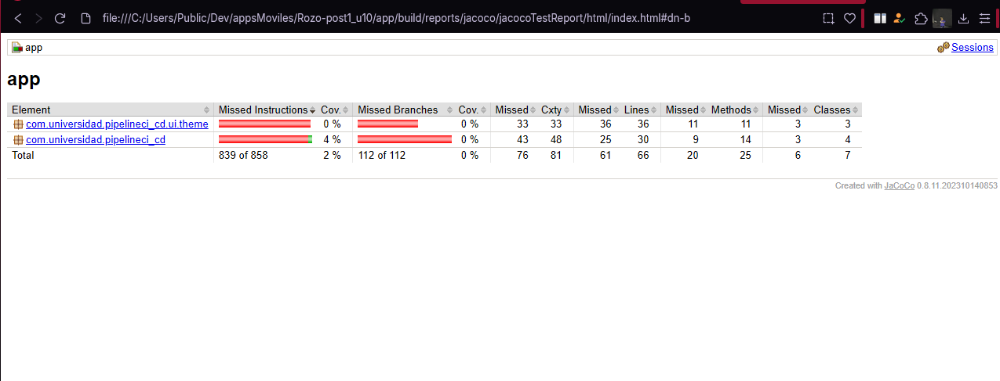

# Pipeline CI/CD Android con GitHub Actions

## Autor

**Nombre:** Jhoseth Esneider Rozo Carrillo  
**Código:** 02230131027  
**Programa:** Ingeniería de Sistemas  
**Unidad:** Unidad 10 – CI/CD, Publicación y Operación  
**Actividad:** Post-Contenido 1  
**Fecha:** 14/05/2026

---

# Estado del Pipeline


Workflow:  
https://github.com/jerc31/Rozo-post1_u10/actions/workflows/androidci.yml

---

# Descripción del Proyecto

Este proyecto implementa un pipeline CI/CD completo para una aplicación Android utilizando GitHub Actions.

El flujo automatiza el proceso de integración continua y distribución continua de la aplicación, incluyendo:

- Análisis estático de código con Lint
- Ejecución de pruebas unitarias
- Generación de APK Release firmado
- Distribución automática con Firebase App Distribution
- Verificación de cobertura con JaCoCo
- Quality Gate de cobertura mínima

---

# Objetivo

Implementar un pipeline CI/CD funcional para Android que permita:

- Automatizar pruebas y validaciones
- Generar APK Release firmado con Keystore
- Gestionar credenciales mediante GitHub Secrets
- Distribuir builds automáticamente en Firebase
- Configurar un Quality Gate de cobertura mínima
- Generar reportes automáticos de pruebas y cobertura

---

# Tecnologías Utilizadas

- Kotlin
- Android Studio
- GitHub Actions
- Firebase App Distribution
- JaCoCo
- Gradle
- YAML
- PowerShell

---

# Estructura del Proyecto

```text
.github/
└── workflows/
    └── androidci.yml

app/
├── src/
├── build.gradle.kts
└── release-key.jks

gradle/
README.md
```

---

# Configuración de Firebase App Distribution

En el proyecto se configuró Firebase App Distribution para automatizar la distribución de builds release.

## Plugin configurado

### build.gradle.kts (raíz)

```kotlin
plugins {
    id("com.google.firebase.appdistribution") version "5.2.1" apply false
}
```

### build.gradle.kts (app)

```kotlin
plugins {
    id("com.google.firebase.appdistribution")
}
```

---

# Configuración de Signing

El proyecto utiliza un Keystore para firmar automáticamente el APK release.

## Configuración utilizada

```kotlin
signingConfigs {
    create("release") {
        storeFile = file(System.getenv("KEYSTORE_PATH") ?: "release-key.jks")
        storePassword = System.getenv("KEYSTORE_PASS") ?: ""
        keyAlias = System.getenv("KEY_ALIAS") ?: ""
        keyPassword = System.getenv("KEY_PASS") ?: ""
    }
}
```

---

# Configuración de GitHub Secrets

Se configuraron los siguientes secrets en:

```text
Settings → Secrets and variables → Actions
```

| Secret          | Descripción                   |
| --------------- | ----------------------------- |
| KEYSTORE_BASE64 | Keystore codificado en Base64 |
| KEYSTORE_PASS   | Contraseña del Keystore       |
| KEY_ALIAS       | Alias del Keystore            |
| KEY_PASS        | Contraseña del alias          |
| FIREBASE_APP_ID | App ID de Firebase            |
| FIREBASE_TOKEN  | Token Firebase CLI            |

---

# Workflow CI/CD

El workflow principal se encuentra en:

```text
.github/workflows/androidci.yml
```

## Flujo implementado

1. Checkout del proyecto
2. Configuración de Java 17
3. Cache de Gradle
4. Ejecución de Lint
5. Ejecución de pruebas unitarias
6. Generación de reporte JaCoCo
7. Verificación de cobertura
8. Build APK Release firmado
9. Distribución automática en Firebase

---

# Workflow YAML

```yaml
name: Android CI/CD

on:
  push:
    branches: [main, develop]

  pull_request:
    branches: [main]

jobs:
  lint-and-test:
    name: Lint y Pruebas Unitarias
    runs-on: ubuntu-latest

    steps:
      - uses: actions/checkout@v4

      - uses: actions/setup-java@v4
        with:
          java-version: "17"
          distribution: temurin

      - name: Cache Gradle
        uses: actions/cache@v4
        with:
          path: |
            ~/.gradle/caches
            ~/.gradle/wrapper
          key: gradle-${{ hashFiles('**/*.gradle*', '**/gradle-wrapper.properties') }}

      - name: Ejecutar Lint
        run: ./gradlew lintDebug

      - name: Ejecutar Unit Tests
        run: ./gradlew testDebugUnitTest

      - name: Generar reporte JaCoCo
        run: ./gradlew jacocoTestReport

      - name: Subir resultados de pruebas
        uses: actions/upload-artifact@v4
        if: always()
        with:
          name: unit-test-results
          path: "**/build/reports/tests/**"

      - name: Subir reporte de cobertura
        uses: actions/upload-artifact@v4
        with:
          name: jacoco-report
          path: app/build/reports/jacoco/jacocoTestReport/html/

      - name: Quality Gate Coverage > 60%
        run: |
          if [ -f app/build/reports/jacoco/jacocoTestReport/jacocoTestReport.xml ]; then
            COVERAGE=$(python3 -c "import xml.etree.ElementTree as ET; tree = ET.parse('app/build/reports/jacoco/jacocoTestReport/jacocoTestReport.xml'); root = tree.getroot(); line_counter = [c for c in root.findall('counter') if c.get('type') == 'LINE'][0]; covered = int(line_counter.get('covered')); missed = int(line_counter.get('missed')); print(covered / (covered + missed))")
            echo "Line coverage is $COVERAGE"
            python3 -c "import sys; sys.exit(0 if float($COVERAGE) >= 0.60 else 1)"
          else
            echo "Jacoco report not found"
            exit 1
          fi

  build-and-distribute:
    name: Build y Distribución
    runs-on: ubuntu-latest
    needs: lint-and-test
    if: github.ref == 'refs/heads/main'

    steps:
      - uses: actions/checkout@v4

      - uses: actions/setup-java@v4
        with:
          java-version: "17"
          distribution: temurin

      - name: Decode Keystore
        run: |
          echo "${{ secrets.KEYSTORE_BASE64 }}" | base64 -d > release-key.jks
          echo "KEYSTORE_PATH=$(pwd)/release-key.jks" >> $GITHUB_ENV

      - name: Build Release APK
        env:
          KEYSTORE_PATH: ${{ env.KEYSTORE_PATH }}
          KEYSTORE_PASS: ${{ secrets.KEYSTORE_PASS }}
          KEY_ALIAS: ${{ secrets.KEY_ALIAS }}
          KEY_PASS: ${{ secrets.KEY_PASS }}
        run: ./gradlew assembleRelease

      - name: Distribuir en Firebase
        uses: wzieba/Firebase-Distribution-Github-Action@v1
        with:
          appId: ${{ secrets.FIREBASE_APP_ID }}
          token: ${{ secrets.FIREBASE_TOKEN }}
          file: app/build/outputs/apk/release/app-release.apk
          releaseNotes: "Build ${{ github.run_number }} — ${{ github.sha }}"
```

---

# Configuración de JaCoCo

Se configuró JaCoCo para generar reportes HTML y XML de cobertura.

## Configuración implementada

```kotlin
jacoco {
    toolVersion = "0.8.11"
}

tasks.withType<Test> {
    finalizedBy(tasks.named("jacocoTestReport"))
}
```

---

# Quality Gate de Cobertura

El pipeline implementa un Quality Gate que bloquea el build si la cobertura de líneas es inferior al 60%.

## Objetivo del Quality Gate

Garantizar que el código distribuido tenga un mínimo de pruebas automatizadas antes de ser publicado.

---

# Verificación de APK Firmado

Para verificar la firma del APK se utilizó:

```powershell
& "C:\Android\Sdk\build-tools\37.0.0\apksigner.bat" verify --verbose "app/build/outputs/apk/release/app-release.apk"
```

## Resultado esperado

```text
Verified using v2 scheme (APK Signature Scheme v2): true
```

---

# Pruebas Unitarias

Se implementaron pruebas unitarias para aumentar la cobertura real del proyecto.

## Ejemplo de prueba

```kotlin
@Test
fun sumaCorrecta() {
    assertEquals(4, calculator.suma(2, 2))
}
```

---

# Checkpoints Verificados

## ✓ Checkpoint 1: Pipeline Básico Funcional

- Workflow `androidci.yml` configurado
- GitHub Secrets configurados
- Job `lint-and-test` ejecutado correctamente
- Artifacts generados correctamente

---

## ✓ Checkpoint 2: Build Firmado y Distribuido

- Build Release ejecutado correctamente
- APK firmado verificado con `apksigner`
- Distribución exitosa en Firebase App Distribution
- Builds visibles en Firebase Console

---

## ✓ Checkpoint 3: Quality Gate Configurado

- JaCoCo configurado correctamente
- Reportes HTML generados
- Artifacts de cobertura subidos al workflow
- Pipeline validando cobertura mínima
- Badge documentado en README

---

# Flujo Completo del Pipeline

```text
Push/Pull Request
        ↓
Lint
        ↓
Unit Tests
        ↓
JaCoCo Coverage
        ↓
Quality Gate
        ↓
Build Release APK
        ↓
Firma con Keystore
        ↓
Firebase App Distribution
```

---

## Capturas del Proyecto

Las siguientes evidencias se encuentran en la carpeta `/evidencias/`:

## Job Lint y build and distribution exitosos en Actions


## Artefactos del repositorio accesibles


## Firebase App Distribution exitosa



## Verificación firmado del apk


## Reportes de Jacoco


## Reporte de cobertura



---

# Conclusiones

Con este laboratorio se logró implementar un flujo CI/CD completo para Android utilizando GitHub Actions y Firebase App Distribution.

Además del proceso automatizado de build y distribución, se integró un sistema de validación de calidad mediante JaCoCo y un Quality Gate de cobertura mínima, permitiendo detectar automáticamente builds con pruebas insuficientes antes de distribuir nuevas versiones.

El proyecto también aplica buenas prácticas de seguridad utilizando GitHub Secrets para proteger credenciales sensibles relacionadas con el Keystore y Firebase.

```

```
